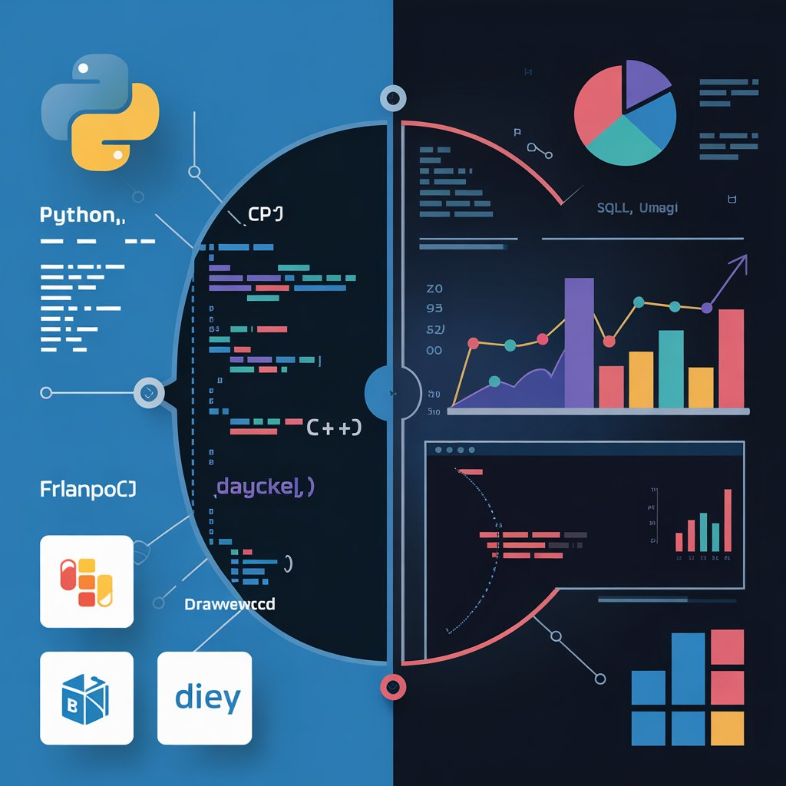

# 👋 Hey there, I'm Paul 

I'm a passionate **Software Engineer**, now expanding into **Data Analysis** and **Data Engineering**. I love turning data into insights, building efficient systems, and creating tech that solves real-world problems.

---

    

## 💼 What I Do

### 🔧 Software Engineering
- Full Stack Web Development (Frontend & Backend)
- Programming: `C`, `C++`, `Ruby`, `JavaScript`, `Python`
- Frameworks: `Django`, `Flask`
- Tools: `Puppet`, `Git`, `Linux`, `Docker`

### 📊 Data Analysis
- Tools: `Excel (Advanced)`, `Power BI`, `SQL`, `Python (Pandas, Matplotlib, Seaborn)`
- Database: `Microsoft SQL Server`
- Projects: Health Analytics, Sales Dashboards, Excel Automations

### 🛠️ Data Engineering (In Progress)
- Skills: `ETL`, `Data Cleaning`, `Database Design`
- Learning: `Airflow`, `BigQuery`, `Data Warehousing Concepts`

---

## 📁 Project Categories

🔹 [Software Engineering Projects]
🔹 [Data Analysis Dashboards]
🔹 [Excel Automation & VBA Projects] 
🔹 [SQL Data Projects]

---

## 🧠 Currently Learning
- DAX for Power BI
- Data Pipelines
- Advanced SQL
- Cloud Platforms for Data (AWS/GCP)

---

## 📬 Let's Connect

- 📧[email](Tunmisejayeoba@email.com) 
- 💼 [LinkedIn](https://www.linkedin.com/in/jayking-paul-771654203/)
 

---

> "Consistency builds growth. I'm always building, always learning."

